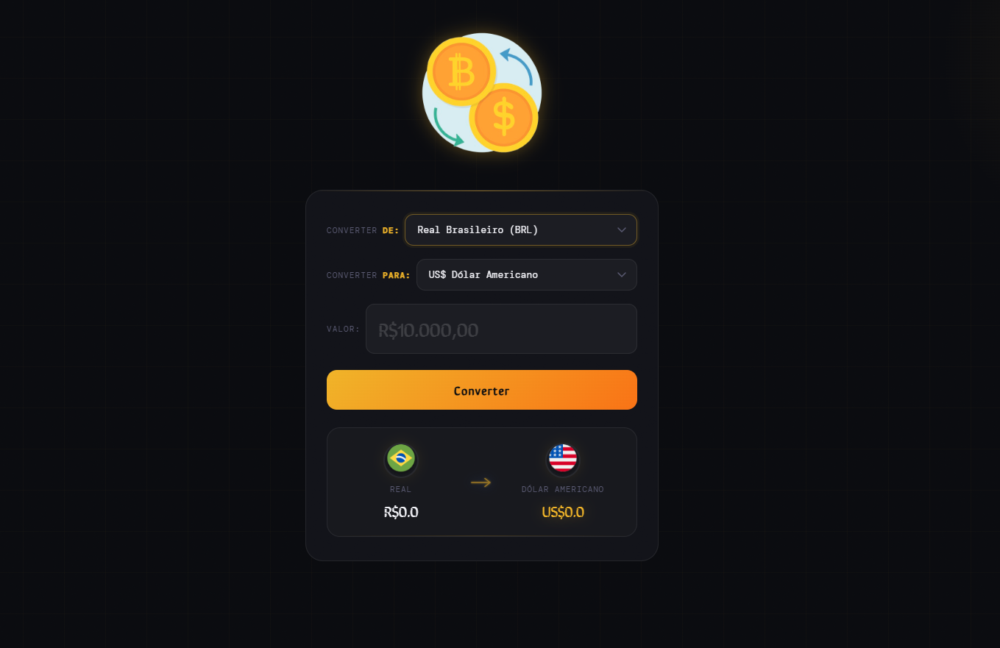

# 💱 Convert Money

Conversor de moedas em tempo real com suporte a Dólar, Euro e Bitcoin, desenvolvido com HTML, CSS e JavaScript puro.

---

## 🚀 Funcionalidades

- Conversão de **Real Brasileiro (BRL)** para:
  - 🇺🇸 Dólar Americano (USD)
  - 🇪🇺 Euro (EUR)
  - ₿ Bitcoin (BTC)
- Cotações em **tempo real** via API
- Interface dark moderna e responsiva

---

## 🖥️ Preview



---

## 🛠️ Tecnologias

- HTML5
- CSS3
- JavaScript (ES6+)
- [AwesomeAPI](https://economia.awesomeapi.com.br/) — cotações em tempo real

---

## 🌐 API utilizada

[AwesomeAPI - Economia](https://economia.awesomeapi.com.br/)

```
https://economia.awesomeapi.com.br/last/USD-BRL,EUR-BRL,BTC-BRL
```

Retorna a cotação mais recente do Dólar, Euro e Bitcoin em relação ao Real.

---

## 📌 Melhorias futuras

- [ ] Adicionar mais moedas (Libra, Iene, etc.)
- [ ] Histórico de conversões
- [ ] Modo claro / escuro
- [ ] Versão mobile aprimorada

---

## 👨‍💻 Autor

Feito com 💛 por **seu-nome**  
[](https://github.com/seu-usuario)
